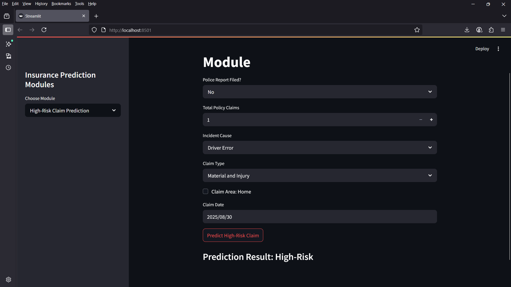

# Insurance Final Project

## 📌 Project Overview
This project is an **AI-Powered Insurance Risk Assessment and Customer Insights System**.  
It integrates multiple machine learning models and data processing pipelines to handle tasks such as:

- Risk classification (high-risk prediction)
- Claim amount prediction
- Customer segmentation
- Sentiment analysis on insurance reviews
- Data preprocessing and cleaning

The system is designed to be used by insurers for better **risk management, fraud detection, and customer insights**.

---

## 📂 Project Structure

```
insurance_final_project/
    app/
        insurance_app.py              # Main Streamlit app entry point
        sample_insurer_doc.docx       # Example insurer document
        temp.docx                     # Temporary doc for testing
        data/
            sentiment_cleaned_data.csv
            cleaned_data/             # Processed datasets
                cleaned_insurance_data.csv
                customer_segmentation_data_cleaned.csv
                customer_segmentation_data_scaled.csv
                insurance_claims_cleaned.csv
                sentiment_cleaned_data.csv
            raw_data/                 # Original/raw datasets
                customer_segmentation_data.csv
                insurance_claims.csv
                insurance_claims_cleaned.csv
                insurance_review_sentiment.csv
                synthetic_insurance_claims.csv
        models/                       # Pre-trained ML models
            rf_high_risk_predict_model.joblib
            rf_predict_claim_model.pkl
        notebooks/                    # Jupyter notebooks for model training/EDA
            high_risk_predict_model.ipynb
            insurance_customer_segmentation.ipynb
            claim_amount_prediction.ipynb
            sentiment_analysis.ipynb
```

---

## ⚙️ Installation & Setup

1. Clone this repository or extract the project zip file.
2. Install dependencies (recommended: create a virtual environment first):

```bash
pip install -r requirements.txt
```

If `requirements.txt` is missing, manually install core libraries:

```bash
pip install streamlit pandas scikit-learn joblib torch transformers
```

---

## ▶️ Running the Application

Run the Streamlit app from the project root:

```bash
cd insurance_final_project/app
streamlit run insurance_app.py
```

The app will launch in your browser at:  
👉 [http://localhost:8501](http://localhost:8501)

---
## 📸 Application Demo

### 1. Automated Insurance Q&A


### 2. High-Risk Claim Prediction


### 3. Multilingual Insurance Document Translation


---

## 🎥 Video Demos

### 1. Insurance Summary Recording  
[▶ Watch Demo](videos/insurance_summary_recording.mp4)

### 2. Multilingual Translation Demo  
[▶ Watch Demo](videos/multi_lingual_transaltion.mp4)


## 📊 Components

- **Data**:  
  - `raw_data/` → Original datasets  
  - `cleaned_data/` → Preprocessed datasets ready for ML models  

- **Models**:  
  Pre-trained machine learning models stored in `.joblib` or `.pkl` format.  

- **Notebooks**:  
  Jupyter notebooks containing model training, EDA, and preprocessing steps.  

- **App**:  
  A Streamlit-based interactive dashboard to run predictions and analyze insights.  

---

## 🔮 Future Improvements

- Add fraud detection model  
- Deploy app on cloud (AWS/GCP/Azure)  
- Add multilingual support for sentiment analysis  
- Build API endpoints for model predictions  

---

## 👨‍💻 Author
Developed as part of an **Insurance Data Science Project** combining ML, NLP, and interactive dashboards.
